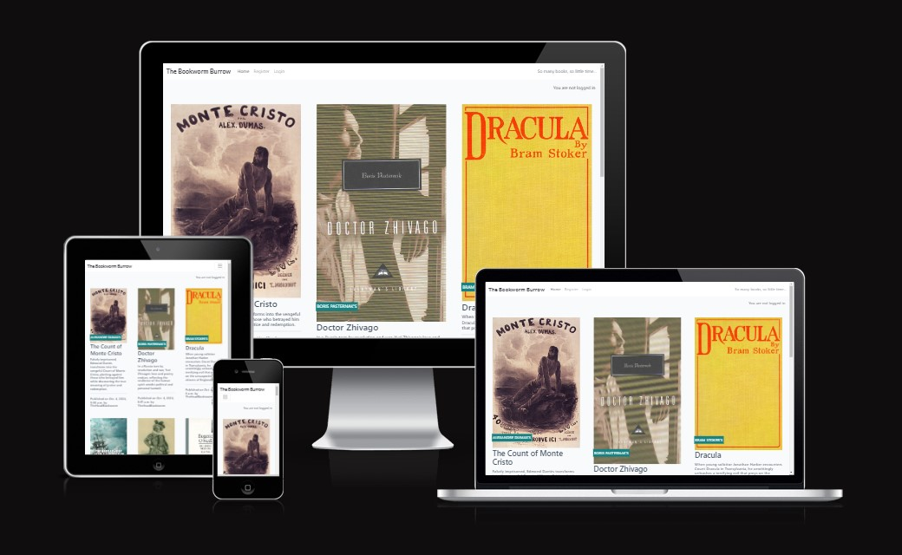

 
<h1 align="center">Bookworm Burrow</h1>
 
The page is deployed here: https://bookwormburrow-1107f1b88f25.herokuapp.com/  
The project board is available at: https://github.com/users/Matthieu-Arn/projects/7
  

**Bookworm Burrow** is a meeting place for avid book readers looking for their next read!  
The site offers a curated list of titles for which a full book profile is available (summary, genre, publication details, a short biography of the author). All site users can browse the available titles and read the reviews left by registered users under each individual book profile.  
Registered users can add a review under any book profile, and can also update and delete their reviews if they so wish. Registered users can also add books to their reading list, which can be modified at any time by changing the status of their chosen books ("To read", "Read - Good read", and "Read - Not so good"), or by removing them from the list.  
Admin users can add, modify or delete new book profiles, add, modify or delete author profiles, and approve user reviews.

 

## Table of Contents
  - [User Experience](https://github.com/Matthieu-Arn/BookwormBurrow/blob/main/README.md#user-experience)
  - [Design](https://github.com/Matthieu-Arn/BookwormBurrow/blob/main/README.md#design)
  - [Technologies Used](https://github.com/Matthieu-Arn/BookwormBurrow/blob/main/README.md#technologies-used)
  - [Testing](https://github.com/Matthieu-Arn/BookwormBurrow/blob/main/README.md#testing)
  - [Deployment](https://github.com/Matthieu-Arn/BookwormBurrow/blob/main/README.md#deployment)
  - [Credits](https://github.com/Matthieu-Arn/BookwormBurrow/blob/main/README.md#credits)

 

## User Experience

### User Stories
  - As a **User (registered or not)**, I can **view a paginated list of book profiles** so that I can **select which I want to view**
  - As a **User (registered or not)**, I can **click on a book profile** so that I can **read the full text**
  - As a **User / Site Admin**, I can **view book reviews on an individual book profile** so that I can **read the comments**
  - As a **User**, I can **register an account** so that I can **add a review to a book profile**
  - As a **User (registered)**, I can **leave a book review on a book profile** so that I can **be involved in the conversation**
  - As a **User (registered)**, I can **modify or delete my review(s) under a book profile** so that I can **be involved in the conversation**
  - As a **Site Admin**, I can **create, read, update and delete book profiles** so that I can **manage my blog content**
  - As a **Site Admin**, I can **create draft book profiles** so that I can **finish writing the content later**
  - As a **Site Admin**, I can **approve or disapprove book reviews** so that I can **filter out objectionable reviews**
  - As a **User (registered)**, I can **create my own reading list** so that I can **decide on what book to read next**

 

## Features

### Existing Features
  - Structure, Presentation and Functionality
    The website is simply presented over few pages. The landing page (Home) offers a paginated list of books. Users, registered or not can navigate across the list and access a full profile for any given book by clicking on its title.  
    For registered users, it is possible to add a review or comment under each book profile, to edit, or even delite said review. It is also possible, from each book profile, to add the book to a user-specific reading list. This list can be accessed from the navigation bar when users are logged in, allowing them to have a quick overview of their list, and of the status of the titles it contains (not read, read and enjoyed, read and not enjoyed). It is of course possible to remove title from the list at any time.

### Future Features
  - Detailed User Profile page, where registered users can keep personal notes on the books they have read or those they wish to read.
  - Detailed Author page, whre for evey author ion the data base, a full profile including list of books availables on the website, can be accessed. This can be completed by various resources (links towards third partyresources for instance)
  - Contact form to be made available to all users
  - Addition of various response modals to improve User experience when adding/removing items from the reading list

 

## Design

### Entity Relationship Diagrams
  - ERDs were created in Lucidchart prior to development, in order to structure the database relationships

  

### Imagery
  - Pictures of book covers and authors were sourced, from Wikimedia/Creative Commons.    

### Colour Scheme
  - The colour scheme is neutral, in a nod to national libray websites such as the British Libray (https://www.bl.uk/)or the French National Libray (https://gallica.bnf.fr/accueil/en/content/accueil-en)

### Typography
  - In the same spirit as the colour scheme, the typography is neutral (Roboto, Lato).

### Wireframes
  - Wireframes were created in Balsamiq prior to development, in order to gauge proportions and overall organisations of the pages

  
  

 

## Technologies Used
  
### Languages Used
  - HTML5
  - CSS3 / Bootstrap
  - JavaScript
  - Django

### Resources & Programmes used
  - - Programmes & Tools
    - Google Fonts
    - GitPod & GitHub: for code development and code safekeeping respectively 
    - Balsamiq: to develop wireframes
    - Paint.net: to edit the images used in assets and documentation
    - Snipping Tool: to take screen captures of various documentation images
  - Resources
    - Coding Resources 
      - W3Schools https://www.w3schools.com/
      - Stack Overflow https://stackoverflow.com/
      - SheCodes https://www.shecodes.io/
      - GitHub Docs https://docs.github.com/en
      - Markdown Guide https://www.markdownguide.org/
      - Code Institute LMS https://learn.codeinstitute.net/ci_program/fsbootcamp231121
      - Google DevTools https://developer.chrome.com/docs/devtools
      - ReadMe file https://github.com/elainebroche-dev/ms1-thrive/tree/master
    - Background Information on books and their authors
      - Wikipedia https://en.wikipedia.org/wiki/Main_Page
          
 

## Testing
  Testing was unfortunately not performed at scale.  
  
  ### Browser Compatibility
  Browser compatibility and responsiveness were tested across platforms and devices, and did not offer significant failure.

  ### Known Bugs
  Under individual book profiles, buttons to add or remove the current book from a reading list are not working as they should (The "Remove from reading list" button should not appear if the book is not on the reading list, while the "Add to reading list" button should not appear if the book is already on the reading list) 

 

## Deployment
  - The site was deployed from the early stages of development using GitHub and Heroku
  - The live site can be found at: https://bookwormburrow-1107f1b88f25.herokuapp.com/

 

## Credits

### Content

### Code
  - Project structure and architecture adapted or inspired from several walkthrough projects as provided by the *Code Institute*'s LMS
  - ReadMe structure adapted from Elaine Roche's *Thrive Juices and Smoothies* website 
  - Several coding issues were resolved using documentation and archived discussion boards available from *W3Schools*, *Stack Overflow*, *She Codes*, etc., 
  - Several bugs identified and fixed using *ChatGPT*

### Media
  - As stated above, media sourced from Wikimedia / Creative Commons wherever possible. Several book covers however were sourced from online retailers (Waterstones, Amazon)
  - The author aknowledges that this project and all its content are for educational purposes only, and that copyrighted materials are included under fair use provisions